```mermaid
flowchart TB
    subgraph current["ContosoUniversity.csproj"]
        MAIN["<b>⚙️&nbsp;ContosoUniversity.csproj</b><br/><small>net48</small>"]
        click MAIN "#contosouniversitycontosouniversitycsproj"
    end

```

# Projects and dependencies analysis

This document provides a comprehensive overview of the projects and their dependencies in the context of upgrading to .NETCoreApp,Version=v10.0.

## Table of Contents

- [Executive Summary](#executive-Summary)
  - [Highlevel Metrics](#highlevel-metrics)
  - [Projects Compatibility](#projects-compatibility)
  - [Package Compatibility](#package-compatibility)
  - [API Compatibility](#api-compatibility)
- [Aggregate NuGet packages details](#aggregate-nuget-packages-details)
- [Top API Migration Challenges](#top-api-migration-challenges)
  - [Technologies and Features](#technologies-and-features)
  - [Most Frequent API Issues](#most-frequent-api-issues)
- [Projects Relationship Graph](#projects-relationship-graph)
- [Project Details](#project-details)

  - [ContosoUniversity\ContosoUniversity.csproj](#contosouniversitycontosouniversitycsproj)

## Executive Summary

### Highlevel Metrics

| Metric | Count | Status |
| :--- | :---: | :--- |
| Total Projects | 1 | All require upgrade |
| Total NuGet Packages | 10 | 8 need upgrade |
| Total Code Files | 26 |  |
| Total Code Files with Incidents | 15 |  |
| Total Lines of Code | 1314 |  |
| Total Number of Issues | 266 |  |
| Estimated LOC to modify | 245+ | at least 18.6% of codebase |

### Projects Compatibility

| Project | Target Framework | Difficulty | Package Issues | API Issues | Est. LOC Impact | Description |
| :--- | :---: | :---: | :---: | :---: | :---: | :--- |
| [ContosoUniversity\ContosoUniversity.csproj](#contosouniversitycontosouniversitycsproj) | net48 | 🔴 High | 17 | 245 | 245+ | Wap, Sdk Style = False |

### Package Compatibility

| Status | Count | Percentage |
| :--- | :---: | :---: |
| ✅ Compatible | 2 | 20.0% |
| ⚠️ Incompatible | 7 | 70.0% |
| 🔄 Upgrade Recommended | 1 | 10.0% |
| ***Total NuGet Packages*** | ***10*** | ***100%*** |

### API Compatibility

| Category | Count | Impact |
| :--- | :---: | :--- |
| 🔴 Binary Incompatible | 169 | High - Require code changes |
| 🟡 Source Incompatible | 76 | Medium - Needs re-compilation and potential conflicting API error fixing |
| 🔵 Behavioral change | 0 | Low - Behavioral changes that may require testing at runtime |
| ✅ Compatible | 686 |  |
| ***Total APIs Analyzed*** | ***931*** |  |

## Aggregate NuGet packages details

| Package | Current Version | Suggested Version | Projects | Description |
| :--- | :---: | :---: | :--- | :--- |
| EntityFramework | 6.1.3 | 6.5.1 | [ContosoUniversity.csproj](#contosouniversitycontosouniversitycsproj) | NuGet package upgrade is recommended |
| Microsoft.ApplicationInsights | 2.1.0 | 3.0.0 | [ContosoUniversity.csproj](#contosouniversitycontosouniversitycsproj) | ⚠️NuGet package is incompatible |
| Microsoft.ApplicationInsights.Agent.Intercept | 1.2.1 |  | [ContosoUniversity.csproj](#contosouniversitycontosouniversitycsproj) | ⚠️NuGet package is incompatible |
| Microsoft.ApplicationInsights.DependencyCollector | 2.1.0 | 2.23.0 | [ContosoUniversity.csproj](#contosouniversitycontosouniversitycsproj) | ⚠️NuGet package is incompatible |
| Microsoft.ApplicationInsights.PerfCounterCollector | 2.1.0 | 2.23.0 | [ContosoUniversity.csproj](#contosouniversitycontosouniversitycsproj) | ⚠️NuGet package is incompatible |
| Microsoft.ApplicationInsights.Web | 2.1.0 |  | [ContosoUniversity.csproj](#contosouniversitycontosouniversitycsproj) | ⚠️NuGet package is incompatible |
| Microsoft.ApplicationInsights.WindowsServer | 2.1.0 | 2.23.0 | [ContosoUniversity.csproj](#contosouniversitycontosouniversitycsproj) | ⚠️NuGet package is incompatible |
| Microsoft.ApplicationInsights.WindowsServer.TelemetryChannel | 2.1.0 | 2.23.0 | [ContosoUniversity.csproj](#contosouniversitycontosouniversitycsproj) | ⚠️NuGet package is incompatible |
| Microsoft.CodeDom.Providers.DotNetCompilerPlatform | 1.0.0 |  | [ContosoUniversity.csproj](#contosouniversitycontosouniversitycsproj) | NuGet package functionality is included with framework reference |
| Microsoft.Net.Compilers | 1.0.0 |  | [ContosoUniversity.csproj](#contosouniversitycontosouniversitycsproj) | NuGet package functionality is included with framework reference |

## Top API Migration Challenges

### Technologies and Features

| Technology | Issues | Percentage | Migration Path |
| :--- | :---: | :---: | :--- |
| ASP.NET Framework (System.Web) | 168 | 68.6% | Legacy ASP.NET Framework APIs for web applications (System.Web.*) that don't exist in ASP.NET Core due to architectural differences. ASP.NET Core represents a complete redesign of the web framework. Migrate to ASP.NET Core equivalents or consider System.Web.Adapters package for compatibility. |
| Legacy Configuration System | 18 | 7.3% | Legacy XML-based configuration system (app.config/web.config) that has been replaced by a more flexible configuration model in .NET Core. The old system was rigid and XML-based. Migrate to Microsoft.Extensions.Configuration with JSON/environment variables; use System.Configuration.ConfigurationManager NuGet package as interim bridge if needed. |

### Most Frequent API Issues

| API | Count | Percentage | Category |
| :--- | :---: | :---: | :--- |
| T:System.Web.UI.WebControls.TextBox | 15 | 6.1% | Binary Incompatible |
| T:System.Web.UI.WebControls.GridView | 12 | 4.9% | Binary Incompatible |
| P:System.Web.UI.WebControls.TextBox.Text | 10 | 4.1% | Binary Incompatible |
| P:System.Data.SqlClient.SqlDataReader.Item(System.String) | 8 | 3.3% | Source Incompatible |
| T:System.Web.UI.WebControls.DetailsView | 8 | 3.3% | Binary Incompatible |
| T:System.Web.UI.WebControls.DropDownList | 6 | 2.4% | Binary Incompatible |
| P:System.Web.UI.WebControls.BaseDataBoundControl.DataSource | 6 | 2.4% | Binary Incompatible |
| T:System.Web.UI.WebControls.Button | 5 | 2.0% | Binary Incompatible |
| T:System.Web.UI.WebControls.TableCellCollection | 5 | 2.0% | Binary Incompatible |
| P:System.Web.UI.WebControls.TableRow.Cells | 5 | 2.0% | Binary Incompatible |
| T:System.Web.UI.WebControls.TableCell | 5 | 2.0% | Binary Incompatible |
| P:System.Web.UI.WebControls.TableCellCollection.Item(System.Int32) | 5 | 2.0% | Binary Incompatible |
| M:System.Web.UI.Page.#ctor | 5 | 2.0% | Binary Incompatible |
| T:System.Web.UI.Page | 5 | 2.0% | Binary Incompatible |
| T:System.Web.UI.StateBag | 5 | 2.0% | Binary Incompatible |
| P:System.Web.UI.Control.ViewState | 5 | 2.0% | Binary Incompatible |
| P:System.Web.UI.StateBag.Item(System.String) | 5 | 2.0% | Binary Incompatible |
| T:System.Data.SqlClient.SqlParameter | 4 | 1.6% | Source Incompatible |
| T:System.Web.UI.ControlCollection | 4 | 1.6% | Binary Incompatible |
| P:System.Web.UI.Control.Controls | 4 | 1.6% | Binary Incompatible |
| T:System.Web.UI.Control | 4 | 1.6% | Binary Incompatible |
| P:System.Web.UI.ControlCollection.Item(System.Int32) | 4 | 1.6% | Binary Incompatible |
| M:System.Data.SqlClient.SqlConnection.Close | 3 | 1.2% | Source Incompatible |
| M:System.Data.SqlClient.SqlDataReader.Close | 3 | 1.2% | Binary Incompatible |
| M:System.Data.SqlClient.SqlDataReader.Read | 3 | 1.2% | Source Incompatible |
| T:System.Data.SqlClient.SqlDataReader | 3 | 1.2% | Source Incompatible |
| M:System.Data.SqlClient.SqlCommand.ExecuteReader | 3 | 1.2% | Source Incompatible |
| M:System.Data.SqlClient.SqlConnection.Open | 3 | 1.2% | Source Incompatible |
| T:System.Data.SqlClient.SqlCommand | 3 | 1.2% | Source Incompatible |
| M:System.Data.SqlClient.SqlCommand.#ctor(System.String,System.Data.SqlClient.SqlConnection) | 3 | 1.2% | Source Incompatible |
| T:System.Data.SqlClient.SqlConnection | 3 | 1.2% | Source Incompatible |
| M:System.Data.SqlClient.SqlConnection.#ctor(System.String) | 3 | 1.2% | Source Incompatible |
| T:System.Configuration.ConfigurationManager | 3 | 1.2% | Source Incompatible |
| T:System.Configuration.ConnectionStringSettingsCollection | 3 | 1.2% | Source Incompatible |
| P:System.Configuration.ConfigurationManager.ConnectionStrings | 3 | 1.2% | Source Incompatible |
| T:System.Configuration.ConnectionStringSettings | 3 | 1.2% | Source Incompatible |
| P:System.Configuration.ConnectionStringSettingsCollection.Item(System.String) | 3 | 1.2% | Source Incompatible |
| P:System.Configuration.ConnectionStringSettings.ConnectionString | 3 | 1.2% | Source Incompatible |
| M:System.Web.UI.WebControls.GridView.DataBind | 3 | 1.2% | Binary Incompatible |
| M:System.Web.UI.WebControls.DetailsView.DataBind | 3 | 1.2% | Binary Incompatible |
| P:System.Web.UI.Page.IsPostBack | 3 | 1.2% | Binary Incompatible |
| T:System.Web.UI.WebControls.Table | 2 | 0.8% | Binary Incompatible |
| T:System.Data.SqlClient.SqlParameterCollection | 2 | 0.8% | Source Incompatible |
| P:System.Data.SqlClient.SqlCommand.Parameters | 2 | 0.8% | Source Incompatible |
| M:System.Data.SqlClient.SqlParameterCollection.Add(System.Data.SqlClient.SqlParameter) | 2 | 0.8% | Source Incompatible |
| P:System.Data.SqlClient.SqlParameter.Direction | 2 | 0.8% | Source Incompatible |
| P:System.Data.SqlClient.SqlParameter.Value | 2 | 0.8% | Source Incompatible |
| P:System.Data.SqlClient.SqlParameter.ParameterName | 2 | 0.8% | Source Incompatible |
| M:System.Data.SqlClient.SqlParameter.#ctor | 2 | 0.8% | Source Incompatible |
| T:System.Web.UI.WebControls.ListItemCollection | 2 | 0.8% | Binary Incompatible |

## Projects Relationship Graph

Legend:
📦 SDK-style project
⚙️ Classic project

## Project Details

### ContosoUniversity\ContosoUniversity.csproj

#### Project Info

- **Current Target Framework:** net48
- **Proposed Target Framework:** net10.0
- **SDK-style**: False
- **Project Kind:** Wap
- **Dependencies**: 0
- **Dependants**: 0
- **Number of Files**: 54
- **Number of Files with Incidents**: 15
- **Lines of Code**: 1314
- **Estimated LOC to modify**: 245+ (at least 18.6% of the project)

#### Dependency Graph

Legend:
📦 SDK-style project
⚙️ Classic project

### API Compatibility

| Category | Count | Impact |
| :--- | :---: | :--- |
| 🔴 Binary Incompatible | 169 | High - Require code changes |
| 🟡 Source Incompatible | 76 | Medium - Needs re-compilation and potential conflicting API error fixing |
| 🔵 Behavioral change | 0 | Low - Behavioral changes that may require testing at runtime |
| ✅ Compatible | 686 |  |
| ***Total APIs Analyzed*** | ***931*** |  |

#### Project Technologies and Features

| Technology | Issues | Percentage | Migration Path |
| :--- | :---: | :---: | :--- |
| Legacy Configuration System | 18 | 7.3% | Legacy XML-based configuration system (app.config/web.config) that has been replaced by a more flexible configuration model in .NET Core. The old system was rigid and XML-based. Migrate to Microsoft.Extensions.Configuration with JSON/environment variables; use System.Configuration.ConfigurationManager NuGet package as interim bridge if needed. |
| ASP.NET Framework (System.Web) | 168 | 68.6% | Legacy ASP.NET Framework APIs for web applications (System.Web.*) that don't exist in ASP.NET Core due to architectural differences. ASP.NET Core represents a complete redesign of the web framework. Migrate to ASP.NET Core equivalents or consider System.Web.Adapters package for compatibility. |

